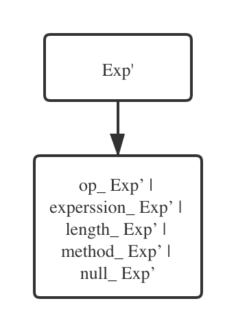

[TOC]

# MJava 语法规则

- Goal-> MainClass *{* ClassDeclaration *}* EOF
- MainClass-> **"class"** Identifier **"{"** **"public"** **"static"** **"void"** **"main"** **"("** **"String"** **"["** **"]"** Identifier **")"** **"{"** Statement **"}"** **"}"**
- ClassDeclaration-> **"class"** Identifier *[* **"extends"** Identifier *]* **"{"** *{* VarDeclaration *}* *{* MethodDeclaration *}* **"}"**
- VarDeclaration-> Type Identifier **";"**
- MethodDeclaration-> **"public"** Type Identifier **"("** *[* Type Identifier *{* **","** Type Identifier *}* *]* **")"** **"{"** *{* VarDeclaration *}* *{* Statement *}* **"return"** Expression **";"** **"}"**
- Type-> **"int"** **"["** **"]"***|***"boolean"***|***"int"***|* Identifier
- Statement-> **"{"** *{* Statement *}* **"}"***|***"if"** **"("** Expression **")"** Statement **"else"** Statement *|***"while"** **"("** Expression **")"** Statement *|***"System.out.println"** **"("** Expression **")"** **";"***|* Identifier **"="** Expression **";"***|* Identifier **"["** Expression **"]"** **"="** Expression **";"**
- Expression-> Expression *(* "&&" | "<" | "+" | "-" | "*" *)* Expression *|* Expression **"["** Expression **"]"***|* Expression **"."** **"length"***|* Expression **"."** Identifier **"("** *[* Expression *{* **","** Expression *}* *]* **")"***|* IntegerLiteral *|***"true"***|***"false"***|* Identifier *|***"this"***|***"new"** **"int"** **"["** Expression **"]"***|***"new"** Identifier "(" ")"*|* **"!"** Expression *|***"("** Expression **")"**

# 抽象语法树

## 消除左递归

- Goal-> MainClass *{* ClassDeclaration *}* EOF

- MainClass-> **"class"** Identifier **"{"** **"public"** **"static"** **"void"** **"main"** **"("** **"String"** **"["** **"]"** Identifier **")"** **"{"** Statement **"}"** **"}"**

- ClassDeclaration-> **"class"** Identifier *[* **"extends"** Identifier *]* **"{"** *{* VarDeclaration *}* *{* MethodDeclaration *}* **"}"**

- VarDeclaration-> Type Identifier ";"

- MethodDeclaration-> **"public"** Type Identifier **"("** *[* Type Identifier *{* **","** Type Identifier *}* *]* **")"** **"{"** *{* VarDeclaration *}* *{* Statement *}* **"return"** Expression **";"** **"}"**

- Type-> **"int"** **"["** **"]"***|***"boolean"***|***"int"***|* Identifier

- Statement-> **"{"** *{* Statement *}* **"}"***|***"if"** **"("** Expression **")"** Statement **"else"** Statement *|***"while"** **"("** Expression **")"** Statement *|***"System.out.println"** **"("** Expression **")"** **";"***|* Identifier **"="** Expression **";"***|* Identifier **"["** Expression **"]"** **"="** Expression **";"**

- Expression-> IntegerLiteral Exp’ /

  "true" Exp’/

  "false" Exp’/

  Identifier Exp’/

  "this" Exp’/

  "new" "int" "[" Expression "]" Exp’/

  "new" Identifier "(" ")" A Exp’/

  "!" Expression Exp’/

  "(" Expression ")" Exp’

- Exp’-> ( "&&" | "<" | "+" | "-" | "*" ) Expression Exp’/

   "[" Expression "]" Exp’/

   "." "length" Exp’/

   "." Identifier "(" [ Expression { "," Expression } ] ")" Exp’/ 

   ε

## 画出抽象语法树

- Goal-> MainClass *{* ClassDeclaration *}* EOF

  

- MainClass-> **"class"** Identifier **"{"** **"public"** **"static"** **"void"** **"main"** **"("** **"String"** **"["** **"]"** Identifier **")"** **"{"** Statement **"}"** **"}"**

  

- ClassDeclaration-> **"class"** Identifier *[* **"extends"** Identifier *]* **"{"** *{* VarDeclaration *}* *{* MethodDeclaration *}* **"}"**

  

- VarDeclaration-> Type Identifier **";"**

  

- MethodDeclaration-> **"public"** Type Identifier **"("** *[* Type Identifier *{* **","** Type Identifier *}* *]* **")"** **"{"** *{* VarDeclaration *}* *{* Statement *}* **"return"** Expression **";"** **"}"**

  

- Type-> **"int"** **"["** **"]"***|***"boolean"***|***"int"***|* Identifier

  

- Statement-> StatementSeries | if_Statement | While_Statement | Print_Statement | VarAssign_Statement | ArrayAssign_Statement

  

- StatementSeries-> **"{"** { Statement } **"}"**

  

- If_Satement-> **"if"** **"("** Expression **")"** Statement **"else"** Statement

  

- While_Satement-> **"while"** **"("** Expression **")"** Statement 

  

- Print_Statement-> **"System.out.println"** **"("** Expression **")"** **";"**

  

- VarAssign_Statement-> identifier **"="** Expression **";"**

  

- ArrayAssign_Statement-> identifier **"["** Expression **"]"** **"="** Expression **";**

  .png)

- Expression-> int_Expression | true_Expression | false_Expression | identifier_Expression | this_Expression | newArray_Expression | new_Expression | not_Expression | brace_Expression

  

- int_Expression-> IntegerLiteral **Exp’**

  

- true_Expression**-> "true"** **Exp’**

  

- false_Expression**-> "false"** **Exp’**

  

- identifier_Expression-> Identifier **Exp’**

  

- this_Expression**-> "this"** **Exp’**

  

- newArray_Expression**-> "new"** **"int"** **"["** **Expression** **"]"** **Exp’**

  

- new_Expression**-> "new"** Identifier "(" ")" **Exp’**

  

- not_Expression**-> "!"** **Expression** **Exp’**

  

- brace_Expression-> **"("** **Expression** **")"** **Exp’**

  

- **Exp’**-> op_ **Exp’** | experssion_ **Exp’** | length_ **Exp’** | method_ **Exp’** | null_ **Exp’**

  

- Op_ **Exp’**-> ( "&&" | "<" | "+" | "-" | "*" ) **Expression** **Exp’**

  

- Experssion_ **Exp’**-> **"["** **Expression** **"]"** **Exp’**

  .png)

- Length_ **Exp’**-> **"."** **"length"** **Exp’**

  

- Method_ **Exp’**-> **"."** Identifier **"("** [ **Expression** { **","** **Expression** } ] **")"** **Exp’**

  

- Null_ **Exp’**-> ε

  