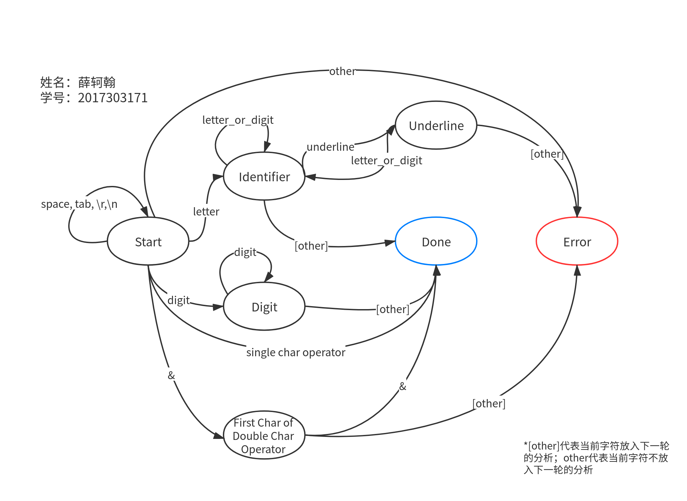

# MJava-Compiler

## Scanner

### 状态转换图



说明：

- `First Char of Double Char Operator`代表`&&`等由两个字符组成的操作符。
- `String`包含了标示符和关键字两种类型，代码中做了判断。

### 程序运行说明

本工程基于CMake进行构建，并在Ubuntu16.04系统下测试通过。

可以直接导入支持CMake的IDE中进行编译。或者通过cmake进行命令行编译：

```bash
cd Scanner/
mkdir build
cd build
cmake ..
make -j4
```

然后生成可执行文件`mjava-scanner`。注意，运行该可执行文件时，要将其与测试文件方成如下组织目录：


或者在main.cpp中修改运行时文件的路径重新编译即可（由于考虑到尽可能的减少运行依赖项以方便评阅老师方便评阅代码，位采用读取配置文件的方式）。

### 程序设计与方案

将程序翻译为了进行词法分析后的结果，存到`testX_token.txt`中，错误信息存储到`testX_token_error.txt`中。如：

`test1.txt`的一段代码：

```C++
    public int Juggling(){
        boolean t;
        int tmp1;
        int tmp2;
        int tmp3;
        tmp1 = 2;
        tmp2 = 3;
        tmp3 = 4;
        while((tmp2 < tmp3)&(tmp1<tmp2)){
            tmp1 = tmp3 - tmp2;
            tmp2 = tmp2 - tmp1;
            tmp3 = tmp2 * tmp1;
            t = this.HolyLight();
        }
        return (tmp1*tmp2+tmp3)*messagelist.length;
    }
```

程序运行后，`test1_token.txt`：

```
    PUBLIC INT IDENTIFIER L_PARENTHESES R_PARENTHESES L_BRACE
        BOOLEAN IDENTIFIER SEMICOLON
        INT IDENTIFIER SEMICOLON
        INT IDENTIFIER SEMICOLON
        INT IDENTIFIER SEMICOLON
        IDENTIFIER ASSIGNMENT DIGIT SEMICOLON
        IDENTIFIER ASSIGNMENT DIGIT SEMICOLON
        IDENTIFIER ASSIGNMENT DIGIT SEMICOLON
        IDENTIFIER L_PARENTHESES L_PARENTHESES IDENTIFIER LESS_THAN IDENTIFIER R_PARENTHESES L_PARENTHESES IDENTIFIER LESS_THAN IDENTIFIER R_PARENTHESES R_PARENTHESES L_BRACE
            IDENTIFIER ASSIGNMENT IDENTIFIER SUB IDENTIFIER SEMICOLON
            IDENTIFIER ASSIGNMENT IDENTIFIER SUB IDENTIFIER SEMICOLON
            IDENTIFIER ASSIGNMENT IDENTIFIER MULTI IDENTIFIER SEMICOLON
            IDENTIFIER ASSIGNMENT THIS POINT IDENTIFIER L_PARENTHESES R_PARENTHESES SEMICOLON
        R_BRACE
        RETURN L_PARENTHESES IDENTIFIER MULTI IDENTIFIER ADD IDENTIFIER R_PARENTHESES MULTI IDENTIFIER POINT LENGTH SEMICOLON
    R_BRACE

```

`test1_token_error.txt`：

```
标识符/test1.txt:19:9 error: "_", incorrect syntax!
标识符/test1.txt:52:31 error: ">", incorrect syntax!
标识符/test1.txt:69:29 error: "&", undefined operator!
```

报错信息解释：

前面为报错的文件名，然后是行号和列号，后面是具体的错误信息。

- `incorrect syntax!`表示出现了非法的字符
- `undefined operator!`表示定义的（二字符）操作符不合法
- `incorrect definition syntax!`表示定义的字符串的语法不合法

### 关于错误判别的说明

- 比如遇到`1flow1`的话，会识别成整数`1`和标识符`flow1`，而不会报错，错误处理由接下来的语法分析来做。
- 同理，`0.0`也是会识别成整数`0`、运算符`.`和整数`0`